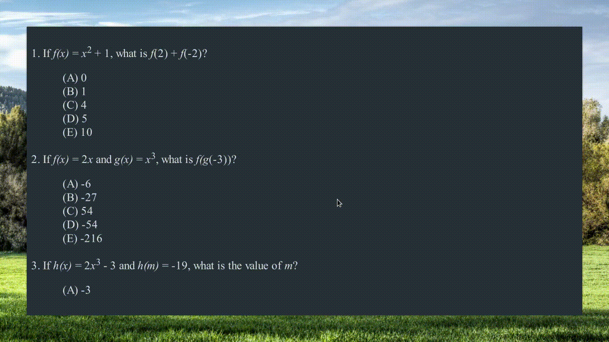

## GRE applet

GRE practice test companion. Keep track of your progress and where you spend time the most.

Demo


### Dependencies:
- python
- PySimpleGUI library 

### Installation (Mac/Linux)
1. first, install the gui library
    ```
    sudo pip install PySimpleGui
    ```
    You may or may not require `sudo`.
1. clone the repo
    ```bash
    git clone https://github.com/bibek22/gre-applet.git
    ```
1. `cd` into the directory
    ```bash
    cd gre-applet
    ```
1. run the app
    ```bash
    ./button.py
    ```


Features:
- clean, unobstrusive GUI
- keeps track of time you spent on each question
- reads in correct answers once the test is done and shows result
- tabulated results
- allows anotating results
- logs report on to a file
- can answer with multiple answer choices (use input field)

Missing:
- haven't tested on Windows
- feature to flag questions

FAQ:

- How is the answer key read?

  Answer key is read on the second window which pops up once you click `Done` on the first widget.

  You can put spaces however you like. Those are ignored. Each new non space character is counted as a answer key. 

  `ABC` `A B C` `AB C` are all equivalent and mean questions 1-3 have the correct answers `A`, `B` and `C` respectively.

- How do I pick more than one options for a question?

    Just type `ABC` with keyboard on the input field if you want to choose `A`, `B` and `C` options.
    Make sure you put a parenthesis around `ABC` when you provide the answer key on second window so that it counts as one response.
    Like so: `(ABC)`

    Also notice that there's a counter that helps you keep track of how many answer keys you've entered. The counter counts the entire parenthesis block as 1.

- How about numerical input?

    Same thing as above. Just type in the answers and put parenthesis around the correct answer on the second screen.

    `A(1/2)B` implies the correct answer for the second question is `1/2`.